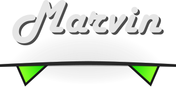

   
  
   

<h3 align="center">Python utilities for Machine Learning</h3>

  
  
  

  <a href="#synopsis"><b>Synopsis</b></a>&nbsp;&bull;
  <a href="#installation"><b>Installation</b></a>&nbsp;&bull;
  <a href="#examples"><b>Examples</b></a>&nbsp;&bull;

   

  

# Synopsis

Marvin is a collection of machine learning utilities for Python 3.6+.

# Installation

Marvin can be installed directly from GitHub with

~~~ bash
python3 -m pip install git+https://github.com/P403n1x87/marvin
~~~

# Examples

For more details please refer to the [wiki](https://github.com/P403n1x87/marvin/wiki).
